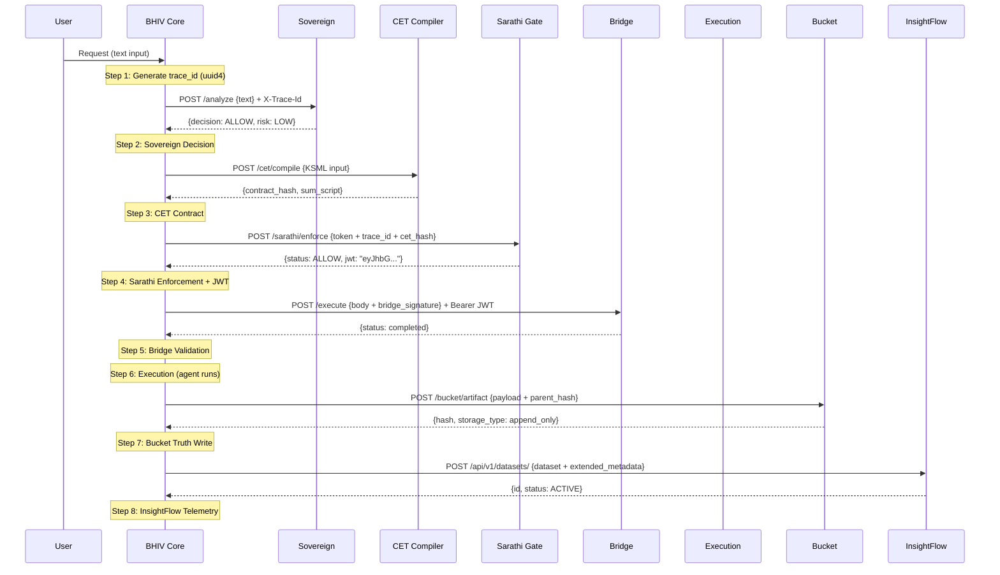

# Canonical Runtime Sequence — Phase IV Final

Version: 3.0.0
Date: 2026-06-20
Status: ✅ **8/8 VERIFIED**

---

## Overview

This document defines the exact execution sequence of the TANTRA runtime chain. Every production execution follows this 8-step sequence. Each step is proven with live HTTP evidence.

---

## Sequence Diagram

---

## Step Details

### Step 1: Trace Origin
- **Actor:** Core
- **Action:** Generate uuid4 trace_id
- **Output:** trace_id propagated to all subsequent steps
- **Failure:** Cannot fail (local)

### Step 2: Sovereign Decision
- **Actor:** Core → Sovereign
- **Protocol:** POST /analyze
- **Input:** `{"text": "..."}` + `X-Trace-Id` header
- **Output:** `{decision, risk_category, risk_score}`
- **Decision Logic:** risk_category ∈ {LOW, MEDIUM} → ALLOW, else DENY
- **Failure Mode:** FAIL-CLOSED (unreachable = execution blocked)

### Step 3: CET Contract Compilation
- **Actor:** Core → CET
- **Protocol:** POST /cet/compile
- **Input:** KSML object with 7 keys (decision_id, trace_id, intent, actors, constraints, context, timestamp)
- **Output:** `{contract_hash, sum_script}`
- **Schema:** actors=dict, constraints=[{left,operator,right}], intent="TransferFunds"
- **Failure Mode:** FAIL-CLOSED or internal fallback hash

### Step 4: Sarathi Enforcement
- **Actor:** Core → Sarathi
- **Protocol:** POST /sarathi/enforce
- **Input:** `{token: {execution_id, rajya_verdict, token_status, timestamp, signature_hash}, trace_id, cet_hash}`
- **Signature:** signature_hash = SHA-256(`execution_id|rajya_verdict|timestamp`)
- **Output:** `{status: "ALLOW", jwt: "eyJhbG..."}`
- **JWT Claims:** iss=tantra-sarathi, aud=tantra-bridge, execution_id, trace_id, cet_hash, jti
- **Failure Mode:** FAIL-CLOSED (blocked = SarathiEnforcementError)

### Step 5: Bridge Validation
- **Actor:** Core → Bridge
- **Protocol:** POST /execute
- **Input Body:** `{trace_id, execution_id, execution_token, contract_hash, cet_hash, bridge_signature, timestamp}`
- **Input Headers:** `Authorization: Bearer <JWT>`, `X-Sarathi-Execution-Id`, `X-Sarathi-Trace-Id`, `X-Sarathi-Cet-Hash`
- **bridge_signature:** SHA-256(`trace_id|execution_id|contract_hash`)
- **Validation:** JWT signature (RS256 via JWKS), iss/aud, continuity (execution_id + trace_id + cet_hash)
- **Output:** `{trace_id, execution_id, status: "completed", result: {...}}`
- **Failure Mode:** FAIL-CLOSED (401/403 = execution blocked)

### Step 6: Execution
- **Actor:** Core (local agent)
- **Action:** Agent processes the task
- **Output:** task_id, execution result
- **Failure:** Agent-level error handling

### Step 7: Bucket Truth Write
- **Actor:** Core → Bucket
- **Protocol:** POST /bucket/artifact
- **Pre-step:** GET /bucket/chain-state → get parent_hash
- **Input:** `{artifact_id, artifact_type, timestamp_utc, schema_version, source_module_id, parent_hash, payload}`
- **Output:** `{hash, storage_type: "append_only"}`
- **Integrity:** parent_hash chain-links to previous artifact
- **Failure Mode:** FAIL-CLOSED (BucketWriteError = execution FAILED)

### Step 8: InsightFlow Telemetry
- **Actor:** Core → InsightFlow
- **Protocol:** POST /api/v1/datasets/
- **Input:** `{canonical_id, dataset_name, description, owner_name, owner_team, domain_primary, source_system, domain_tags, extended_metadata}`
- **Headers:** `X-API-Key`
- **Output:** `{id, status: "ACTIVE"}`
- **Failure Mode:** GRACEFUL-FALLBACK (local JSONL on failure — non-blocking)

---

## Invariants

1. **trace_id continuity:** Same trace_id from Step 1 through Step 8
2. **execution_id continuity:** Same execution_id from Step 4 through Step 5 and Step 7
3. **contract_hash continuity:** Same contract_hash from Step 3 through Steps 4, 5, 7
4. **Fail-closed governance:** Steps 2, 4, 5, 7 block execution on failure
5. **JWT chain:** Sarathi issues → Core passes → Bridge validates
6. **Hash chain integrity:** Bucket writes are chain-linked via parent_hash
7. **Append-only truth:** Bucket artifacts are immutable
