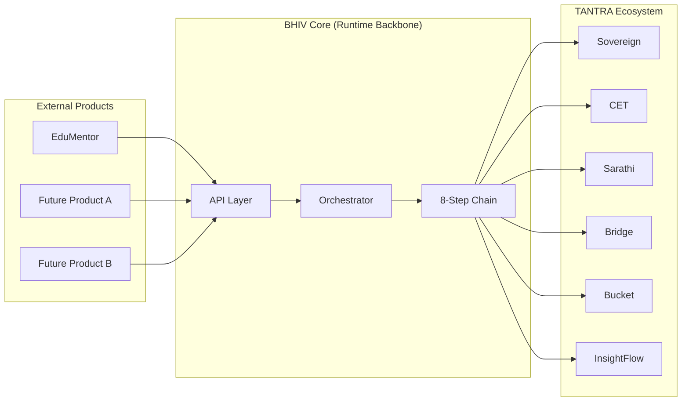

# Product Attachment Framework — Phase IV Final

Version: 3.0.0
Date: 2026-06-20
Status: ✅ Production-ready

---

## Overview

This document defines how external products attach to the TANTRA runtime backbone via BHIV Core. Products do not need to understand the internal chain — they interact through a standardized, configuration-driven interface.

---

## Attachment Model



---

## How Products Attach

### Step 1: Register Product Agent

Add agent configuration to `agent_configs.json`:

```json
{
  "agent_name": "my_product_agent",
  "agent_type": "product",
  "description": "My product's processing agent",
  "capabilities": ["processing", "analysis"],
  "max_concurrent": 5,
  "timeout_seconds": 30
}
```

### Step 2: Create Agent Implementation

Create an agent module in `agents/`:

```python
class MyProductAgent:
    def __init__(self, config):
        self.config = config

    async def execute(self, task_id, input_data, trace_id):
        # Product-specific processing
        result = process(input_data)
        return {"task_id": task_id, "result": result}
```

### Step 3: Submit Execution Request

Products submit requests via the Core API:

```bash
curl -X POST http://localhost:8003/execute \
  -H "Content-Type: application/json" \
  -d '{
    "agent": "my_product_agent",
    "input": {"text": "Process this data"},
    "trace_source": "my_product"
  }'
```

### Step 4: Core Handles Everything

The Core automatically:
1. Generates trace_id
2. Calls Sovereign for risk assessment
3. Calls CET for contract compilation
4. Calls Sarathi for enforcement (gets JWT)
5. Calls Bridge for validation (passes JWT)
6. Executes the product agent
7. Writes to Bucket (truth store)
8. Emits to InsightFlow (telemetry)

The product never directly interacts with Sovereign, CET, Sarathi, Bridge, Bucket, or InsightFlow.

---

## Product Isolation Guarantees

| Guarantee | Description |
|---|---|
| **Trace isolation** | Each product execution gets a unique trace_id |
| **Auth isolation** | JWT scoped to execution_id, not product-wide |
| **Failure isolation** | Product agent failure does not crash the chain |
| **Audit isolation** | Each execution recorded separately in Bucket |
| **Telemetry isolation** | Each execution gets unique InsightFlow dataset |

---

## What Products Get

| Capability | Source | Description |
|---|---|---|
| Risk assessment | Sovereign | Automatic content risk scoring |
| Contract compliance | CET | Execution governed by KSML contracts |
| Cryptographic auth | Sarathi + Bridge | JWT-based execution authorization |
| Immutable audit trail | Bucket | Every execution hash-chained and tamper-proof |
| Dataset telemetry | InsightFlow | Full provenance and discovery |
| Trace continuity | Core | Single trace_id across all services |
| Fail-closed safety | Core | Governance failures block execution |

---

## What Products Must Provide

| Requirement | Details |
|---|---|
| Agent implementation | Python class with `execute(task_id, input_data, trace_id)` |
| Agent config | JSON entry in agent_configs.json |
| Input format | JSON object with `text` or structured data |
| Timeout compliance | Must complete within configured timeout |
| Error handling | Must raise exceptions (not silently fail) |

---

## What Products Must NOT Do

| Forbidden | Reason |
|---|---|
| Call Sovereign directly | Core handles risk assessment |
| Call Sarathi directly | Core handles enforcement |
| Call Bridge directly | Core handles JWT passthrough |
| Modify trace_id | Trace integrity must be preserved |
| Write to Bucket directly | Core handles truth writes |
| Issue JWT tokens | Only Sarathi issues tokens |

---

## Currently Attached Products

| Product | Agent | Status | Owner |
|---|---|---|---|
| EduMentor | edumentor_agent | ✅ Active | Raj |

---

## Attachment Checklist

For any new product:

- [ ] Agent class created in `agents/`
- [ ] Agent config added to `agent_configs.json`
- [ ] Input schema documented
- [ ] Timeout configured
- [ ] Error handling implemented
- [ ] Test execution completed
- [ ] 8-step chain verified with product agent
- [ ] Bucket audit confirmed
- [ ] InsightFlow dataset registered
