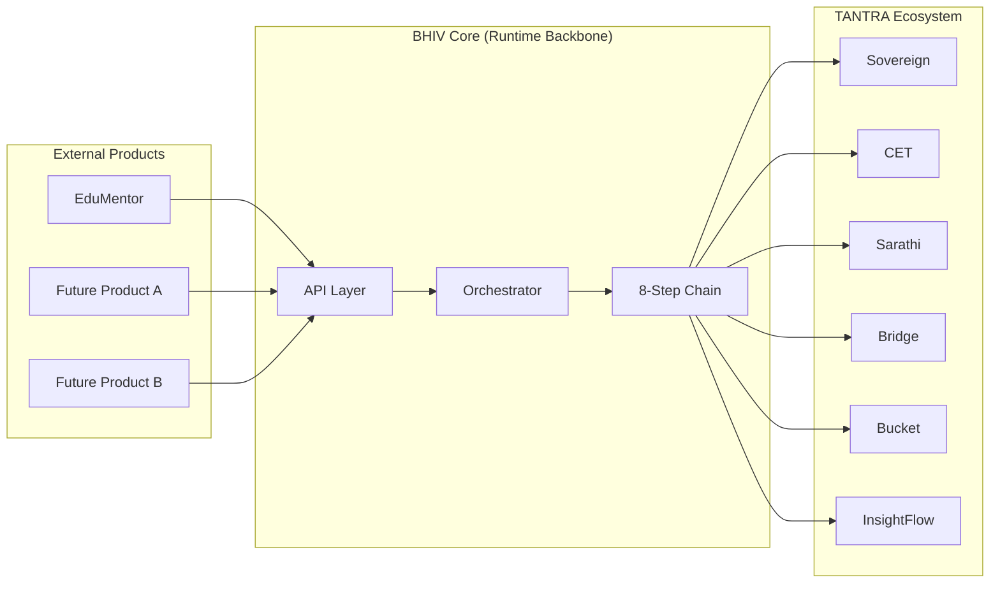

# Product Attachment Framework — Phase IV Final

Version: 3.0.0
Date: 2026-06-20
Status: ✅ Production-ready

---

## Overview

This document defines how external products attach to the TANTRA runtime backbone via BHIV Core. Products do not need to understand the internal chain — they interact through a standardized, configuration-driven interface.

---

## Attachment Model



---

## How Products Attach

### Step 1: Register Product Agent

Add agent configuration to `agent_configs.json`:

```json
{
  "agent_name": "my_product_agent",
  "agent_type": "product",
  "description": "My product's processing agent",
  "capabilities": ["processing", "analysis"],
  "max_concurrent": 5,
  "timeout_seconds": 30
}
```

### Step 2: Create Agent Implementation

Create an agent module in `agents/`:

```python
class MyProductAgent:
    def __init__(self, config):
        self.config = config

    async def execute(self, task_id, input_data, trace_id):
        # Product-specific processing
        result = process(input_data)
        return {"task_id": task_id, "result": result}
```

### Step 3: Submit Execution Request

Products submit requests via the Core API:

```bash
curl -X POST http://localhost:8003/execute \
  -H "Content-Type: application/json" \
  -d '{
    "agent": "my_product_agent",
    "input": {"text": "Process this data"},
    "trace_source": "my_product"
  }'
```

### Step 4: Core Handles Everything

The Core automatically:
1. Generates trace_id
2. Calls Sovereign for risk assessment
3. Calls CET for contract compilation
4. Calls Sarathi for enforcement (gets JWT)
5. Calls Bridge for validation (passes JWT)
6. Executes the product agent
7. Writes to Bucket (truth store)
8. Emits to InsightFlow (telemetry)

The product never directly interacts with Sovereign, CET, Sarathi, Bridge, Bucket, or InsightFlow.

---

## Product Isolation Guarantees

| Guarantee | Description |
|---|---|
| **Trace isolation** | Each product execution gets a unique trace_id |
| **Auth isolation** | JWT scoped to execution_id, not product-wide |
| **Failure isolation** | Product agent failure does not crash the chain |
| **Audit isolation** | Each execution recorded separately in Bucket |
| **Telemetry isolation** | Each execution gets unique InsightFlow dataset |

---

## What Products Get

| Capability | Source | Description |
|---|---|---|
| Risk assessment | Sovereign | Automatic content risk scoring |
| Contract compliance | CET | Execution governed by KSML contracts |
| Cryptographic auth | Sarathi + Bridge | JWT-based execution authorization |
| Immutable audit trail | Bucket | Every execution hash-chained and tamper-proof |
| Dataset telemetry | InsightFlow | Full provenance and discovery |
| Trace continuity | Core | Single trace_id across all services |
| Fail-closed safety | Core | Governance failures block execution |

---

## What Products Must Provide

| Requirement | Details |
|---|---|
| Agent implementation | Python class with `execute(task_id, input_data, trace_id)` |
| Agent config | JSON entry in agent_configs.json |
| Input format | JSON object with `text` or structured data |
| Timeout compliance | Must complete within configured timeout |
| Error handling | Must raise exceptions (not silently fail) |

---

## What Products Must NOT Do

| Forbidden | Reason |
|---|---|
| Call Sovereign directly | Core handles risk assessment |
| Call Sarathi directly | Core handles enforcement |
| Call Bridge directly | Core handles JWT passthrough |
| Modify trace_id | Trace integrity must be preserved |
| Write to Bucket directly | Core handles truth writes |
| Issue JWT tokens | Only Sarathi issues tokens |

---

## Currently Attached Products

| Product | Agent | Status | Owner |
|---|---|---|---|
| EduMentor | edumentor_agent | ✅ Active | Raj |

---

## Future Product Attachment Specifications

### UniGuru

| Field | Value |
|---|---|
| **Product** | UniGuru |
| **Purpose** | University admission guidance and counseling |
| **Trigger** | User submits admission query |
| **Execution Path** | Core → Sovereign (risk check) → CET (admission contract) → Agent (process query) |
| **Trace Path** | trace_id propagated, query + response recorded |
| **Replay Path** | Full query-response chain reconstructable from Bucket |
| **Observability Path** | InsightFlow dataset per session |
| **Truth Persistence** | Bucket: query, response, decision hash |
| **Governance Dependencies** | Sovereign (content risk), Sarathi (auth) |
| **Runtime Health** | Agent health check, timeout 30s |
| **Recovery Behaviour** | FAIL-CLOSED on governance, retry on agent timeout |
| **Version Compatibility** | Core ≥ 1.0.0 |

### HackaVerse

| Field | Value |
|---|---|
| **Product** | HackaVerse |
| **Purpose** | Hackathon management and evaluation platform |
| **Trigger** | Submission evaluation request |
| **Execution Path** | Core → Sovereign (content check) → CET (evaluation contract) → Agent (evaluate) |
| **Trace Path** | trace_id per submission evaluation |
| **Replay Path** | Full evaluation chain from Bucket |
| **Observability Path** | InsightFlow dataset per hackathon event |
| **Truth Persistence** | Bucket: submission, scores, evaluation criteria |
| **Governance Dependencies** | Sovereign (fair evaluation), Sarathi (auth) |
| **Runtime Health** | Agent health, batch processing support |
| **Recovery Behaviour** | FAIL-CLOSED on governance, queue on agent overload |
| **Version Compatibility** | Core ≥ 1.0.0 |

### SETU

| Field | Value |
|---|---|
| **Product** | SETU |
| **Purpose** | Cross-system bridge and data integration layer |
| **Trigger** | Integration request from external system |
| **Execution Path** | Core → Sovereign (data risk) → CET (integration contract) → Agent (transform + route) |
| **Trace Path** | trace_id spans source and destination systems |
| **Replay Path** | Full transformation chain from Bucket |
| **Observability Path** | InsightFlow: integration metrics, data flow telemetry |
| **Truth Persistence** | Bucket: source data hash, transformation log, destination confirmation |
| **Governance Dependencies** | Sovereign (data classification), Sarathi (cross-system auth), Bridge (destination validation) |
| **Runtime Health** | Connectivity checks to source/destination |
| **Recovery Behaviour** | FAIL-CLOSED on auth, retry on connectivity |
| **Version Compatibility** | Core ≥ 1.0.0 |

### SUMSCRIPT

| Field | Value |
|---|---|
| **Product** | SUMSCRIPT |
| **Purpose** | Smart contract execution and validation engine |
| **Trigger** | Contract execution request |
| **Execution Path** | Core → Sovereign (contract risk) → CET (compile SUMSCRIPT) → Agent (execute contract) |
| **Trace Path** | trace_id per contract execution |
| **Replay Path** | Full contract execution chain from Bucket (deterministic replay) |
| **Observability Path** | InsightFlow: contract metrics, execution telemetry |
| **Truth Persistence** | Bucket: compiled contract, execution log, state transitions |
| **Governance Dependencies** | Sovereign (risk), CET (compilation), Sarathi (enforcement) |
| **Runtime Health** | Contract engine health, state consistency checks |
| **Recovery Behaviour** | FAIL-CLOSED (contract execution must be atomic) |
| **Version Compatibility** | Core ≥ 1.0.0, CET contract format required |

### ERP

| Field | Value |
|---|---|
| **Product** | ERP (Enterprise Resource Planning) |
| **Purpose** | Enterprise business process automation |
| **Trigger** | Business process request (invoice, procurement, HR) |
| **Execution Path** | Core → Sovereign (business rule check) → CET (process contract) → Agent (process) |
| **Trace Path** | trace_id per business transaction |
| **Replay Path** | Full transaction audit trail from Bucket |
| **Observability Path** | InsightFlow: business metrics, process telemetry |
| **Truth Persistence** | Bucket: transaction record, approval chain, outcome |
| **Governance Dependencies** | Sovereign (compliance), Sarathi (authorization), Bridge (multi-party validation) |
| **Runtime Health** | Process engine health, database connectivity |
| **Recovery Behaviour** | FAIL-CLOSED on financial transactions, retry on non-critical |
| **Version Compatibility** | Core ≥ 1.0.0 |

### Fraud Detection

| Field | Value |
|---|---|
| **Product** | Fraud Detection |
| **Purpose** | Real-time fraud detection and prevention |
| **Trigger** | Transaction or activity flagged for analysis |
| **Execution Path** | Core → Sovereign (risk scoring) → CET (detection rules contract) → Agent (analyze patterns) |
| **Trace Path** | trace_id per detection event |
| **Replay Path** | Full detection chain from Bucket (forensic replay) |
| **Observability Path** | InsightFlow: detection rates, false positive metrics |
| **Truth Persistence** | Bucket: flagged activity, detection result, evidence hash |
| **Governance Dependencies** | Sovereign (risk threshold), Sarathi (enforcement action) |
| **Runtime Health** | Model inference health, latency < 500ms required |
| **Recovery Behaviour** | FAIL-CLOSED (suspected fraud must block transaction) |
| **Version Compatibility** | Core ≥ 1.0.0 |

### AI Video

| Field | Value |
|---|---|
| **Product** | AI Video |
| **Purpose** | AI-powered video generation and analysis |
| **Trigger** | Video generation or analysis request |
| **Execution Path** | Core → Sovereign (content moderation) → CET (usage contract) → Agent (generate/analyze) |
| **Trace Path** | trace_id per video operation |
| **Replay Path** | Metadata replay from Bucket (video artifacts stored separately) |
| **Observability Path** | InsightFlow: generation metrics, content moderation stats |
| **Truth Persistence** | Bucket: operation metadata, content hash, moderation result |
| **Governance Dependencies** | Sovereign (content moderation critical), Sarathi (usage authorization) |
| **Runtime Health** | GPU availability, model loading status |
| **Recovery Behaviour** | FAIL-CLOSED on content moderation, retry on generation timeout |
| **Version Compatibility** | Core ≥ 1.0.0 |

### Future Robotics

| Field | Value |
|---|---|
| **Product** | Future Robotics |
| **Purpose** | Robot command execution and telemetry |
| **Trigger** | Robot command request |
| **Execution Path** | Core → Sovereign (safety check) → CET (motion contract) → Agent (command execution) |
| **Trace Path** | trace_id per command chain |
| **Replay Path** | Full command chain replay from Bucket (safety audit) |
| **Observability Path** | InsightFlow: telemetry streams, safety metrics |
| **Truth Persistence** | Bucket: command, sensor data hash, outcome |
| **Governance Dependencies** | Sovereign (safety critical), Sarathi (auth), Bridge (real-time validation) |
| **Runtime Health** | Robot connectivity, sensor status, emergency stop capability |
| **Recovery Behaviour** | FAIL-CLOSED (safety-first — any governance failure = emergency stop) |
| **Version Compatibility** | Core ≥ 1.0.0, real-time extension required |

### Future XR

| Field | Value |
|---|---|
| **Product** | Future XR (Extended Reality) |
| **Purpose** | AR/VR/MR experience management |
| **Trigger** | XR session request or interaction event |
| **Execution Path** | Core → Sovereign (content check) → CET (experience contract) → Agent (render/process) |
| **Trace Path** | trace_id per session |
| **Replay Path** | Session metadata replay from Bucket |
| **Observability Path** | InsightFlow: session metrics, interaction telemetry |
| **Truth Persistence** | Bucket: session metadata, interaction log hash |
| **Governance Dependencies** | Sovereign (content moderation), Sarathi (session auth) |
| **Runtime Health** | Rendering engine status, latency requirements |
| **Recovery Behaviour** | GRACEFUL-FALLBACK (degrade experience rather than crash) |
| **Version Compatibility** | Core ≥ 1.0.0 |

### Future Blockchain

| Field | Value |
|---|---|
| **Product** | Future Blockchain |
| **Purpose** | Blockchain transaction management and smart contract bridge |
| **Trigger** | Blockchain transaction or smart contract call |
| **Execution Path** | Core → Sovereign (transaction risk) → CET (on-chain contract) → Agent (submit to chain) |
| **Trace Path** | trace_id linked to on-chain transaction hash |
| **Replay Path** | Full transaction chain from Bucket + on-chain verification |
| **Observability Path** | InsightFlow: transaction metrics, gas costs, confirmation times |
| **Truth Persistence** | Bucket: transaction metadata, block confirmation, state proof |
| **Governance Dependencies** | Sovereign (AML/KYC check), Sarathi (signing authorization), Bridge (multi-sig validation) |
| **Runtime Health** | Node connectivity, chain sync status, gas price monitoring |
| **Recovery Behaviour** | FAIL-CLOSED (blockchain transactions are irreversible) |
| **Version Compatibility** | Core ≥ 1.0.0, chain-specific adapter required |

---

## Attachment Checklist

For any new product:

- [ ] Agent class created in `agents/`
- [ ] Agent config added to `agent_configs.json`
- [ ] Entry added to `TANTRA_INTEGRATION_REGISTRY.json`
- [ ] Input schema documented
- [ ] Timeout configured
- [ ] Error handling implemented
- [ ] Failure mode declared (FAIL-CLOSED or GRACEFUL-FALLBACK)
- [ ] Test execution completed
- [ ] 8-step chain verified with product agent
- [ ] Bucket audit confirmed
- [ ] InsightFlow dataset registered
- [ ] Version compatibility verified
