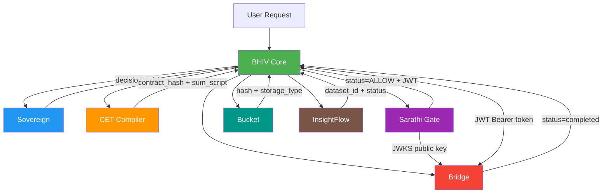

# Runtime Dependency Graph — Phase IV Final

Version: 3.0.0
Date: 2026-06-20
Status: ✅ All dependencies verified with live HTTP

---

## Overview

This document maps every Producer → Consumer relationship in the TANTRA runtime chain. All dependencies are verified with live HTTP evidence from the 8/8 SUCCESS chain.

---

## Dependency Graph



---

## Producer → Consumer Mappings

### Core Produces → Others Consume

| Producer | Artifact | Consumer | Protocol |
|---|---|---|---|
| Core | text input | Sovereign | POST /analyze |
| Core | KSML decision object | CET | POST /cet/compile |
| Core | SarathiTokenInput + trace_id + cet_hash | Sarathi | POST /sarathi/enforce |
| Core | JWT + bridge_signature + X-Sarathi-* | Bridge | POST /execute |
| Core | Execution artifact + parent_hash | Bucket | POST /bucket/artifact |
| Core | Dataset metadata | InsightFlow | POST /api/v1/datasets/ |
| Core | trace_id | All participants | X-Trace-Id header |

### Others Produce → Core Consumes

| Producer | Artifact | Consumer | Evidence |
|---|---|---|---|
| Sovereign | decision (ALLOW/DENY), risk_category | Core | HTTP 200 |
| CET | contract_hash, sum_script | Core | HTTP 200 |
| Sarathi | status (ALLOW), JWT token | Core | HTTP 200 |
| Bridge | status (completed), result | Core | HTTP 200 |
| Bucket | artifact hash, storage_type | Core | HTTP 200 |
| InsightFlow | dataset_id, status (ACTIVE) | Core | HTTP 201 |

### Cross-Service Dependencies

| Producer | Artifact | Consumer | Notes |
|---|---|---|---|
| Sarathi | JWKS (/.well-known/jwks.json) | Bridge | RSA public key for JWT verification |
| Sarathi | JWT (RS256 signed) | Bridge (via Core) | Core forwards as Bearer token |
| CET | contract_hash | Sarathi (via Core) | Embedded in Sarathi token as cet_hash |
| CET | contract_hash | Bridge (via Core) | Validated as cet_hash continuity |
| Bucket | chain_state (last_hash) | Core | Pre-fetched as parent_hash for chain integrity |

---

## Data Flow Summary

```
User Request
    │
    ▼
┌──────────────┐
│  BHIV Core   │ ── trace_id generated
└──────┬───────┘
       │
       ├──► Sovereign ──► decision_hash
       │
       ├──► CET ──► contract_hash
       │
       ├──► Sarathi ──► JWT (RS256)
       │        │
       │        └──► JWKS ──► Bridge (key verification)
       │
       ├──► Bridge ──► status=completed
       │    (Bearer JWT + X-Sarathi-* + bridge_signature)
       │
       ├──► [Agent Execution]
       │
       ├──► Bucket ──► artifact_hash (chain-linked)
       │
       └──► InsightFlow ──► dataset_id (ACTIVE)
```

---

## Failure Propagation

| Failing Service | Impact on Chain | Recovery |
|---|---|---|
| Sovereign unreachable | Chain BLOCKED at Step 2 | FAIL-CLOSED |
| CET unreachable | Chain BLOCKED at Step 3 | Internal fallback hash |
| Sarathi unreachable | Chain BLOCKED at Step 4 | FAIL-CLOSED (SarathiEnforcementError) |
| Sarathi rejects | Chain BLOCKED at Step 4 | FAIL-CLOSED |
| Bridge rejects JWT | Chain BLOCKED at Step 5 | FAIL-CLOSED |
| Bridge unreachable | Chain BLOCKED at Step 5 | FAIL-CLOSED |
| Bucket unreachable | Chain BLOCKED at Step 7 | FAIL-CLOSED (BucketWriteError) |
| InsightFlow unreachable | Chain CONTINUES | GRACEFUL-FALLBACK (local JSONL) |
