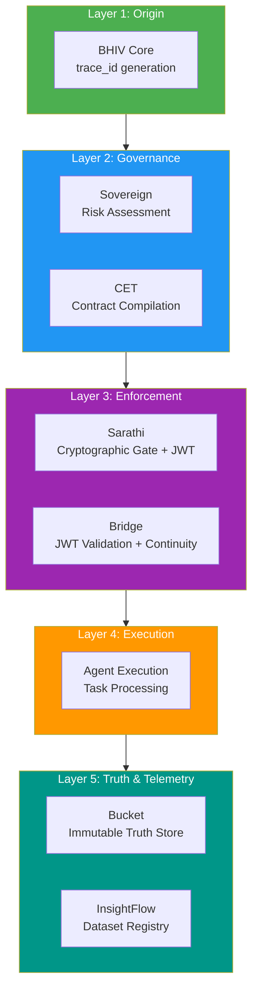

# Runtime Layer Map — Phase IV Final

Version: 3.0.0
Date: 2026-06-20
Status: ✅ All layers verified

---

## Overview

The TANTRA runtime is organized into 5 layers. Each participant belongs to exactly one layer. Execution flows top-down. Each layer must complete before the next begins.

---

## Layer Architecture

---

## Layer 1: Origin

| Participant | Role | Failure Mode |
|---|---|---|
| **BHIV Core** | Generate trace_id, orchestrate chain | Cannot fail (local) |

**Responsibility:** Create the execution trace and initiate the 8-step chain.
**Output:** trace_id (uuid4) propagated to all participants via X-Trace-Id header.

---

## Layer 2: Governance

| Participant | Role | Failure Mode |
|---|---|---|
| **Sovereign** | Risk assessment (ALLOW/DENY) | FAIL-CLOSED |
| **CET** | Contract compilation (KSML → SUM-SCRIPT) | FAIL-CLOSED / fallback |

**Responsibility:** Determine whether execution should proceed and what contract governs it.
**Sovereign Input:** `{"text": "..."}` → Output: `{decision, risk_category, risk_score}`
**CET Input:** KSML 7-key object → Output: `{contract_hash, sum_script}`
**Ordering:** Sovereign and CET can execute in parallel (both depend only on Core).

---

## Layer 3: Enforcement

| Participant | Role | Failure Mode |
|---|---|---|
| **Sarathi** | Cryptographic enforcement + JWT issuance | FAIL-CLOSED |
| **Bridge** | JWT validation + continuity enforcement | FAIL-CLOSED |

**Responsibility:** Cryptographically verify execution authorization and validate token chain.
**Sarathi Input:** Token + trace_id + cet_hash → Output: `{status: ALLOW, jwt: "..."}`
**Bridge Input:** JWT Bearer + bridge_signature → Output: `{status: completed}`
**Ordering:** Sarathi MUST complete before Bridge (Bridge needs Sarathi's JWT).
**JWT Flow:** Sarathi issues RS256 JWT → Core passes as Bearer → Bridge verifies via JWKS.

---

## Layer 4: Execution

| Participant | Role | Failure Mode |
|---|---|---|
| **Core Agent** | Task processing | Agent-level errors |

**Responsibility:** Execute the actual task (e.g., edumentor_agent for educational content).
**Prerequisite:** All Layer 2 and Layer 3 checks must pass.

---

## Layer 5: Truth & Telemetry

| Participant | Role | Failure Mode |
|---|---|---|
| **Bucket** | Immutable truth store (append-only hash chain) | FAIL-CLOSED |
| **InsightFlow** | Dataset registry (telemetry, provenance) | GRACEFUL-FALLBACK |

**Responsibility:** Record execution evidence for auditability and telemetry.
**Bucket:** Append-only with parent_hash chain integrity.
**InsightFlow:** Dataset registration with extended_metadata. Non-blocking — local JSONL fallback.
**Ordering:** Bucket is mandatory (FAIL-CLOSED). InsightFlow is optional (GRACEFUL-FALLBACK).

---

## Layer Authority Matrix

| Layer | Authority | Owner | Can Block Execution? |
|---|---|---|---|
| Origin | Trace generation | Core (Raj) | No |
| Governance | Risk + Contract | Sovereign (Aakanksha) + CET (Tanvi) | Yes |
| Enforcement | Auth + Validation | Sarathi (Rajaryan) + Bridge (Ranjit) | Yes |
| Execution | Task processing | Core (Raj) | N/A |
| Truth | Evidence recording | Bucket (Siddhesh) + InsightFlow (Vijay) | Bucket: Yes, InsightFlow: No |

---

## Cross-Layer Dependencies

| Source Layer | Target Layer | Dependency | Type |
|---|---|---|---|
| L1 → L2 | Origin → Governance | trace_id | Required |
| L2 → L3 | Governance → Enforcement | decision_hash, contract_hash | Required |
| L3 → L3 | Sarathi → Bridge | JWT (via Core) | Required |
| L3 → L3 | Sarathi JWKS → Bridge | RSA public key | Required |
| L3 → L4 | Enforcement → Execution | Authorization | Required |
| L4 → L5 | Execution → Truth | task_id, result | Required |
| L1 → L5 | Origin → Truth | trace_id | Required |
