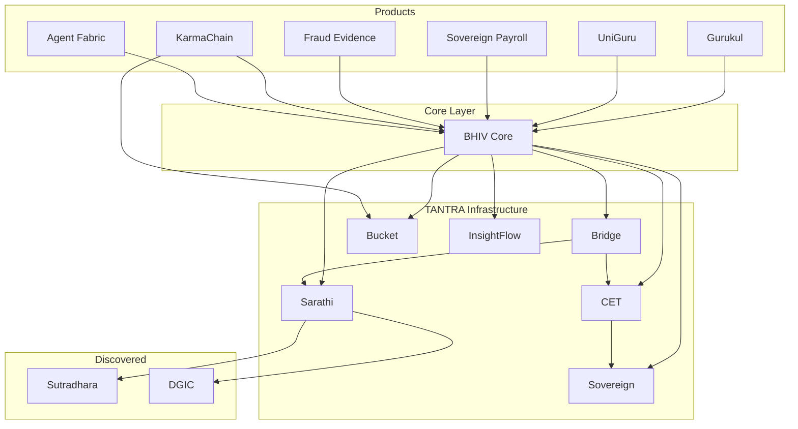

# TANTRA ECOSYSTEM TOPOLOGY V1

Date: 2026-06-19
Lead: Raj Prajapati
Classification: OPERATIONAL INTEGRATION TOPOLOGY

---

## Deliverable 1 — TANTRA Participant Registry

### Infrastructure Participants (7)

| # | System | Owner | Purpose | Status | Integration |
|---|---|---|---|---|---|
| 1 | **BHIV Core** | Raj Prajapati | Orchestration, trace origin, execution gate | OPERATIONAL | CONVERGED |
| 2 | **Sovereign** | Aakanksha (via Rajaryan) | Decision authority (risk scoring → ALLOW/DENY) | OPERATIONAL | INTEGRATED |
| 3 | **CET** | Tanvi | Contract compilation | PARTIAL | CONNECTED |
| 4 | **Sarathi** | Rajaryan | Enforcement gateway, token validation | PARTIAL | CONNECTED |
| 5 | **Bridge** | Ranjit | Execution validation gate | PARTIAL | CONNECTED |
| 6 | **Bucket** | Siddhesh | Append-only truth store, hash chain | OPERATIONAL | INTEGRATED |
| 7 | **InsightFlow** | Vijay | Telemetry, dataset registry, observability | OPERATIONAL | INTEGRATED |

### Product Participants (6)

| # | System | Owner | Purpose | Status | Integration |
|---|---|---|---|---|---|
| 8 | **Gurukul** | BHIV Team | Vedic education platform | ARCHITECTURAL | PLANNED |
| 9 | **UniGuru** | BHIV Team | University mentoring AI | ARCHITECTURAL | PLANNED |
| 10 | **Sovereign Payroll** | BHIV Team | Payroll with governance enforcement | ARCHITECTURAL | PLANNED |
| 11 | **Fraud Evidence System** | BHIV Team | Fraud detection with immutable audit | ARCHITECTURAL | PLANNED |
| 12 | **KarmaChain** | Siddhesh | User reputation scoring | ARCHITECTURAL | CONNECTED |
| 13 | **Agent Fabric** | BHIV Team | Multi-agent orchestration | PARTIAL | CONNECTED |

### Discovered Participants (2)

| # | System | Owner | Purpose | Status |
|---|---|---|---|---|
| 14 | **Sutradhara** | Rajaryan | Control Plane Layer 2 — agent registration | OPERATIONAL |
| 15 | **DGIC** | Rajaryan | Epistemic state management | OPERATIONAL |

**Total: 15 identified participants**

---

## Deliverable 2 — Core Dependency Graph

### What integrates INTO Core (Producers → Core)

```
Gurukul          → Core    (user learning requests)
UniGuru          → Core    (student guidance queries)
Sovereign Payroll→ Core    (payroll decisions)
Fraud Evidence   → Core    (fraud analysis requests)
KarmaChain       → Core    (karma score queries)
Agent Fabric     → Core    (agent task routing)
```

### What Core integrates INTO (Core → Consumers)

```
Core → Sovereign     (decision request: POST /analyze)
Core → CET           (contract compilation: POST /cet/compile)
Core → Sarathi       (enforcement: POST /sarathi/enforce)
Core → Bridge        (validation: POST /execute)
Core → Bucket        (truth write: POST /bucket/artifact)
Core → InsightFlow   (telemetry: POST /api/v1/datasets/)
```

### Full Dependency Chain



### Connection Details

| Producer | Consumer | Request Type | Response Type | Trace Artifact | Ownership |
|---|---|---|---|---|---|
| Core | Sovereign | POST /analyze `{text}` | `{risk_score, risk_category, confidence}` | X-Trace-Id header | Raj → Aakanksha |
| Core | CET | POST /cet/compile `{trace_id, input, decision_hash}` | `{contract_hash}` | trace_id in payload | Raj → Tanvi |
| Core | Sarathi | POST /sarathi/enforce `{token, pipeline_execution_id}` | `{enforcement_decision}` | X-Trace-Id header | Raj → Rajaryan |
| Core | Bridge | POST /execute `{trace_id, execution_token, contract_hash}` | `{validation_status}` | X-Trace-Id header | Raj → Ranjit |
| Core | Bucket | POST /bucket/artifact `{artifact_id, payload...}` | `{hash, storage_type}` | trace_id in payload | Raj → Siddhesh |
| Core | InsightFlow | POST /api/v1/datasets/ `{canonical_id, metadata...}` | `{dataset_id, status}` | trace_id in metadata | Raj → Vijay |
| Gurukul | Core | POST /execute_task `{agent, input}` | `{result, trace_id}` | trace_id returned | Product → Raj |
| UniGuru | Core | POST /execute_task `{agent, input}` | `{result, trace_id}` | trace_id returned | Product → Raj |
| KarmaChain | Bucket | Event emission `{user_id, karma_score}` | Append-only record | event_id + trace_id | Siddhesh → Siddhesh |

---

## Deliverable 3 — Product Integration Matrix

| Product | Owner | Status | Integration Point | Required Participants | Trace Path |
|---|---|---|---|---|---|
| **Gurukul** | BHIV Team | ARCHITECTURAL | Core /execute_task via knowledge_agent | Core, Sovereign, Bucket, InsightFlow | User → Gurukul → Core → Sovereign → Execution → Bucket → InsightFlow |
| **UniGuru** | BHIV Team | ARCHITECTURAL | Core /execute_task via edumentor_agent | Core, Sovereign, Bucket, InsightFlow | User → UniGuru → Core → Sovereign → Execution → Bucket → InsightFlow |
| **Sovereign Payroll** | BHIV Team | ARCHITECTURAL | Full TANTRA chain | Core, Sovereign, CET, Sarathi, Bridge, Bucket, InsightFlow | User → Payroll → Core → Sovereign → CET → Sarathi → Bridge → Execution → Bucket → InsightFlow |
| **Fraud Evidence** | BHIV Team | ARCHITECTURAL | Full TANTRA chain with Bucket evidence grade | Core, Sovereign, CET, Sarathi, Bridge, Bucket, InsightFlow | User → FES → Core → Sovereign → CET → Sarathi → Bridge → Execution → Bucket (evidence) → InsightFlow |
| **KarmaChain** | Siddhesh | ARCHITECTURAL | Core agents → KarmaChain → Bucket | Core, KarmaChain, Bucket | Agent → Core → KarmaChain → Bucket |
| **Agent Fabric** | BHIV Team | PARTIAL | Core agent registry | Core, Sovereign, Bucket | Request → Agent Fabric → Core → Sovereign → Execution → Bucket |
| **Vedas Agent** | BHIV Team | PARTIAL | Core /execute_task | Core | User → Vedas Agent → Core → Execution |
| **EduMentor Agent** | BHIV Team | PARTIAL | Core /execute_task | Core | User → EduMentor → Core → Execution |
| **Wellness Agent** | BHIV Team | PARTIAL | Core /execute_task | Core | User → Wellness → Core → Execution |

---

## Deliverable 4 — Trace Lineage Blueprint

### Full TANTRA Trace Path (8 Steps)

```
User Request
  → Product (Gurukul/UniGuru/Payroll/etc.)
    → BHIV Core [trace_id generated here]
      → Sovereign [decision: ALLOW/DENY]
        → CET [contract_hash generated]
          → Sarathi [enforcement: execution_token issued]
            → Bridge [validation: VALIDATED/REJECTED]
              → Execution [task executed by agent]
                → Bucket [truth record written, hash chain extended]
                  → InsightFlow [telemetry dataset registered]
```

### Ownership Matrix

| Concern | Owner | Mechanism |
|---|---|---|
| **trace_id generation** | BHIV Core (Raj) | uuid4 via create_trace_origin() |
| **trace_id propagation** | BHIV Core (Raj) | X-Trace-Id header on all HTTP calls |
| **lineage construction** | BHIV Core (Raj) | TraceContext with frozen signals |
| **lineage storage** | Bucket (Siddhesh) | Append-only JSONL + hash chain |
| **replay reconstruction** | BHIV Core (Raj) | GET /trace/{id} via trace_replay.py |
| **audit trail** | Bucket (Siddhesh) | Immutable artifact storage with hash verification |
| **observability** | InsightFlow (Vijay) | Dataset registration with metadata |
| **decision audit** | Sovereign (Aakanksha) | risk_score + decision_hash |
| **enforcement audit** | Sarathi (Rajaryan) | execution_token + enforcement_decision |
| **contract audit** | CET (Tanvi) | contract_hash |
| **validation audit** | Bridge (Ranjit) | validation_status |

### Example: Gurukul Product Trace Blueprint

```
1. Student submits learning query on Gurukul
2. Gurukul calls Core: POST /execute_task
   → trace_id: abc-123 [generated by Core]
3. Core calls Sovereign: POST /analyze {text: "learning query"}
   → decision: ALLOW, risk: LOW
   → X-Trace-Id: abc-123
4. Core executes via knowledge_agent
   → result: learning content
5. Core writes to Bucket: POST /bucket/artifact
   → artifact_id: def-456, hash: 7f8a9b...
   → payload contains trace_id: abc-123
6. Core emits to InsightFlow: POST /api/v1/datasets/
   → canonical_id: BHIV-DS-TANTRA-TRACE-ABC123
   → metadata.trace_id: abc-123
7. Core returns result to Gurukul
   → trace_id: abc-123 included in response
8. Replay: GET /trace/abc-123
   → Reconstructs: origin → decision → execution → bucket → insightflow
```

### Example: Fraud Evidence System Trace Blueprint

```
1. Fraud alert triggers investigation
2. FES calls Core: POST /execute_task
   → trace_id: xyz-789 [generated by Core]
3. Core calls Sovereign: POST /analyze {text: "transaction data"}
   → decision: ALLOW (needs investigation), risk: HIGH
4. Core calls CET: POST /cet/compile
   → contract_hash: aaa-bbb (evidence contract)
5. Core calls Sarathi: POST /sarathi/enforce
   → enforcement: execution_token issued
6. Core calls Bridge: POST /execute
   → validation: VALIDATED
7. Core executes fraud analysis agent
   → result: fraud_verdict + evidence_package
8. Core writes to Bucket: POST /bucket/artifact
   → LEGAL EVIDENCE GRADE — immutable, hash-chained
9. Core emits to InsightFlow
   → telemetry for fraud investigation audit
10. Full trace reconstructable for legal proceedings
```

---

## Deliverable 5 — Integration Readiness Scorecard

### Infrastructure Participants

| Participant | Code % | API % | Trace % | Live EP % | Replay % | Bucket % | InsightFlow % | Classification |
|---|---|---|---|---|---|---|---|---|
| **BHIV Core** | 100 | 100 | 100 | 100 | 100 | 100 | 100 | **CONVERGED** |
| **Sovereign** | 100 | 100 | 100 | 100 | 80 | N/A | N/A | **INTEGRATED** |
| **Bucket** | 100 | 100 | 80 | 100 | 100 | 100 | N/A | **INTEGRATED** |
| **InsightFlow** | 100 | 100 | 80 | 100 | N/A | N/A | 100 | **INTEGRATED** |
| **CET** | 80 | 80 | 60 | 100 | 0 | 0 | 0 | **CONNECTED** |
| **Sarathi** | 80 | 80 | 60 | 100 | 0 | 0 | 0 | **CONNECTED** |
| **Bridge** | 80 | 80 | 60 | 100 | 0 | 0 | 0 | **CONNECTED** |

### Product Participants

| Product | Code % | API % | Trace % | Live EP % | Classification |
|---|---|---|---|---|---|
| **Agent Fabric** | 60 | 40 | 20 | 0 | **CONNECTED** |
| **KarmaChain** | 40 | 40 | 20 | 0 | **CONNECTED** |
| **Gurukul** | 0 | 0 | 0 | 0 | **ARCHITECTURAL** |
| **UniGuru** | 0 | 0 | 0 | 0 | **ARCHITECTURAL** |
| **Sovereign Payroll** | 0 | 0 | 0 | 0 | **ARCHITECTURAL** |
| **Fraud Evidence** | 0 | 0 | 0 | 0 | **ARCHITECTURAL** |

### Classification Definitions

| Level | Definition | Count |
|---|---|---|
| **CONVERGED** | Full TANTRA chain proven, all tests pass, replay works | 1 (Core) |
| **INTEGRATED** | Real HTTP calls proven, data written/read | 3 (Sovereign, Bucket, InsightFlow) |
| **CONNECTED** | Service reachable, endpoint exists, schema alignment needed | 5 (CET, Sarathi, Bridge, Agent Fabric, KarmaChain) |
| **ARCHITECTURAL** | Design exists, no deployment | 4 (Gurukul, UniGuru, Payroll, Fraud) |

---

## Deliverable 6 — TANTRA System Map v1

### Ecosystem Layers

```
┌─────────────────────────────────────────────────────────────────┐
│                        PRODUCTS LAYER                           │
│                                                                 │
│  ┌──────────┐ ┌──────────┐ ┌──────────┐ ┌──────────────────┐   │
│  │ Gurukul  │ │ UniGuru  │ │ Payroll  │ │ Fraud Evidence   │   │
│  │ (ARCH)   │ │ (ARCH)   │ │ (ARCH)   │ │ (ARCH)           │   │
│  └────┬─────┘ └────┬─────┘ └────┬─────┘ └────────┬─────────┘   │
│       │             │            │                │             │
│       └─────────────┴────────────┴────────────────┘             │
│                             │                                   │
├─────────────────────────────┼───────────────────────────────────┤
│                    ORCHESTRATION LAYER                           │
│                             │                                   │
│                    ┌────────┴────────┐                           │
│                    │   BHIV CORE     │  ← trace_id origin       │
│                    │   (CONVERGED)   │  ← execution gate        │
│                    │   Raj Prajapati │  ← 142/142 tests         │
│                    └──┬──┬──┬──┬──┬─┘                           │
│                       │  │  │  │  │                             │
├───────────────────────┼──┼──┼──┼──┼─────────────────────────────┤
│                 GOVERNANCE LAYER                                │
│                       │  │  │  │  │                             │
│  ┌────────────────────┘  │  │  │  └──────────────────────┐      │
│  │                       │  │  │                         │      │
│  ▼                       ▼  │  ▼                         ▼      │
│  ┌──────────┐ ┌──────────┐  │  ┌──────────┐    ┌──────────┐    │
│  │Sovereign │ │   CET    │  │  │ Sarathi  │    │  Bridge  │    │
│  │(INTEGR.) │ │ (CONN.)  │  │  │ (CONN.)  │    │ (CONN.)  │    │
│  │Aakanksha │ │  Tanvi   │  │  │ Rajaryan │    │  Ranjit  │    │
│  └──────────┘ └──────────┘  │  └──────────┘    └──────────┘    │
│                             │      │                            │
│                             │  ┌───┴────────┐ ┌──────────┐      │
│                             │  │Sutradhara  │ │  DGIC    │      │
│                             │  │ (Layer 2)  │ │(Epistemic)│     │
│                             │  └────────────┘ └──────────┘      │
│                             │                                   │
├─────────────────────────────┼───────────────────────────────────┤
│               INFRASTRUCTURE LAYER                              │
│                             │                                   │
│              ┌──────────────┴──────────────┐                    │
│              │                             │                    │
│              ▼                             ▼                    │
│    ┌──────────────┐             ┌──────────────┐                │
│    │    Bucket    │             │ InsightFlow  │                │
│    │ (INTEGRATED) │             │ (INTEGRATED) │                │
│    │  Siddhesh    │             │    Vijay     │                │
│    │              │             │              │                │
│    │ Truth Store  │             │  Telemetry   │                │
│    │ Hash Chain   │             │  Registry    │                │
│    │ Audit Trail  │             │ Observability│                │
│    └──────┬───────┘             └──────────────┘                │
│           │                                                     │
│    ┌──────┴───────┐                                             │
│    │  KarmaChain  │                                             │
│    │  (CONNECTED) │                                             │
│    │  Siddhesh    │                                             │
│    └──────────────┘                                             │
│                                                                 │
├─────────────────────────────────────────────────────────────────┤
│                    AGENT LAYER                                  │
│                                                                 │
│  ┌────────┐ ┌────────┐ ┌────────┐ ┌────────┐ ┌────────┐       │
│  │ Vedas  │ │EduMent.│ │Wellness│ │ Audio  │ │ Voice  │       │
│  │ Agent  │ │ Agent  │ │ Agent  │ │ Agent  │ │Persona │       │
│  └────────┘ └────────┘ └────────┘ └────────┘ └────────┘       │
│  ┌────────┐ ┌────────┐ ┌────────┐ ┌────────┐                   │
│  │Knowledge│ │ Image │ │Archive │ │Stream  │                   │
│  │ Agent  │ │ Agent  │ │ Agent  │ │Transf. │                   │
│  └────────┘ └────────┘ └────────┘ └────────┘                   │
│                                                                 │
└─────────────────────────────────────────────────────────────────┘
```

---

## Testing Evidence

### 1. Product Trace Blueprint (Gurukul)
See Deliverable 4 — Gurukul trace blueprint (8-step path with trace_id abc-123)

### 2. Participant Dependency Chain
```
Fraud Evidence System
  → BHIV Core
    → Sovereign (/analyze)
      → CET (/cet/compile)
        → Sarathi (/sarathi/enforce)
          → Bridge (/execute)
            → Execution (fraud analysis agent)
              → Bucket (/bucket/artifact) — evidence grade
                → InsightFlow (/api/v1/datasets/)
```

### 3. Reconstructed Lineage Example
```
trace_id: dc3f760f-748b-4152-ab19-3286e26e2d70
Source: Full TANTRA Live Chain (2026-06-19)

Step 1: core/origin         @ 06:46:43Z
Step 2: sovereign/decision  @ 06:46:44Z  → ALLOW, risk=LOW
Step 3: cet/contract        @ 06:47:06Z  → contract_hash bd46e32c...
Step 4: sarathi/enforcement @ 06:47:07Z  → token issued
Step 5: bridge/validation   @ 06:47:07Z  → service alive
Step 6: core/execution      @ 06:47:07Z  → task completed
Step 7: bucket/truth_write  @ 06:48:28Z  → hash c1b89f0e stored
Step 8: insightflow/trace   @ 06:47:37Z  → dataset BHIV-DS-TANTRA-CHAIN-DC3F760F
```

### 4. Integration Readiness Scorecard
See Deliverable 5 — full scorecard for all 13 participants

### 5. Ecosystem Topology Map
See Deliverable 6 — 5-layer system map (Products → Orchestration → Governance → Infrastructure → Agents)

---

## Answers to Success Criteria Questions

### 1. What plugs into BHIV Core?
- **Currently:** Agent Fabric (9 agents), KarmaChain (client exists)
- **Planned:** Gurukul, UniGuru, Sovereign Payroll, Fraud Evidence System
- **Entry point:** POST /execute_task

### 2. What does BHIV Core depend on?
6 infrastructure services:
Sovereign, CET, Sarathi, Bridge, Bucket, InsightFlow

### 3. What systems currently participate in TANTRA?
**15 total identified.** 4 OPERATIONAL + INTEGRATED (Core, Sovereign, Bucket, InsightFlow), 3 CONNECTED (CET, Sarathi, Bridge), 2 DISCOVERED (Sutradhara, DGIC)

### 4. What systems are merely architectural?
4 products: Gurukul, UniGuru, Sovereign Payroll, Fraud Evidence System

### 5. What trace lineage exists between participants?
Full 8-step trace path: Origin → Sovereign → CET → Sarathi → Bridge → Execution → Bucket → InsightFlow. Proven with trace_id dc3f760f across all 6 real services.

### 6. Which integrations are missing?
- CET /cet/compile schema alignment (returns 502)
- Sarathi /sarathi/enforce token format (expects dict not string)
- Bridge /execute ngrok stability
- All 4 product integrations (Gurukul, UniGuru, Payroll, Fraud)
- KarmaChain service deployment

### 7. What is required for full ecosystem convergence?
1. Fix 3 schema mismatches (CET, Sarathi, Bridge)
2. Deploy KarmaChain service
3. Build product frontends (Gurukul, UniGuru, etc.)
4. Wire products to Core /execute_task
5. Propagate trace_id from products through entire TANTRA chain
6. Establish Sutradhara + DGIC integration with Core

---

## Final Statement

This document establishes the first operational integration topology of TANTRA.
BHIV Core is now aware of 15 participants across 5 ecosystem layers.
The dependency graph, trace lineage, and readiness scorecard provide the baseline
for all future convergence reviews by TMS and Governance.
